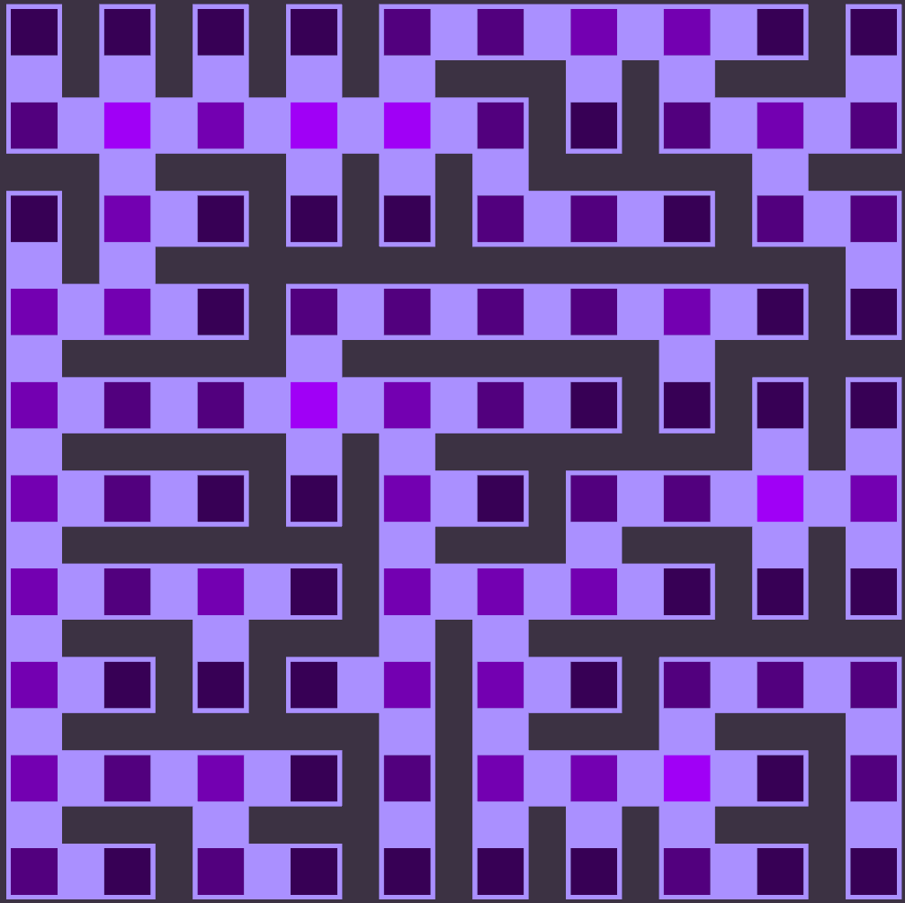
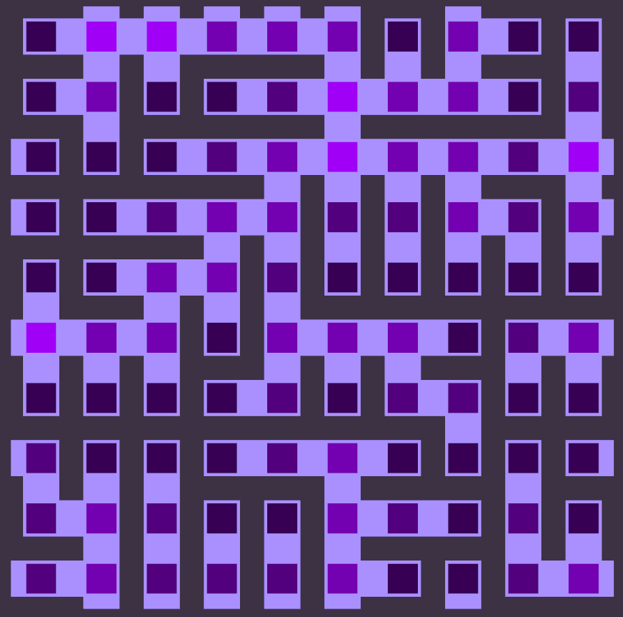
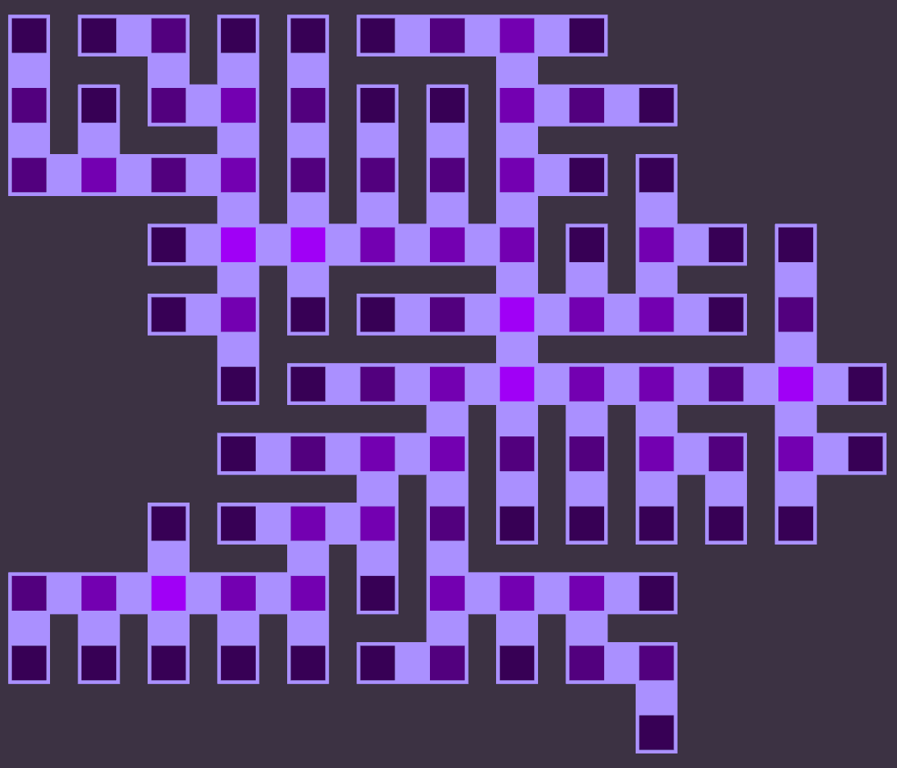
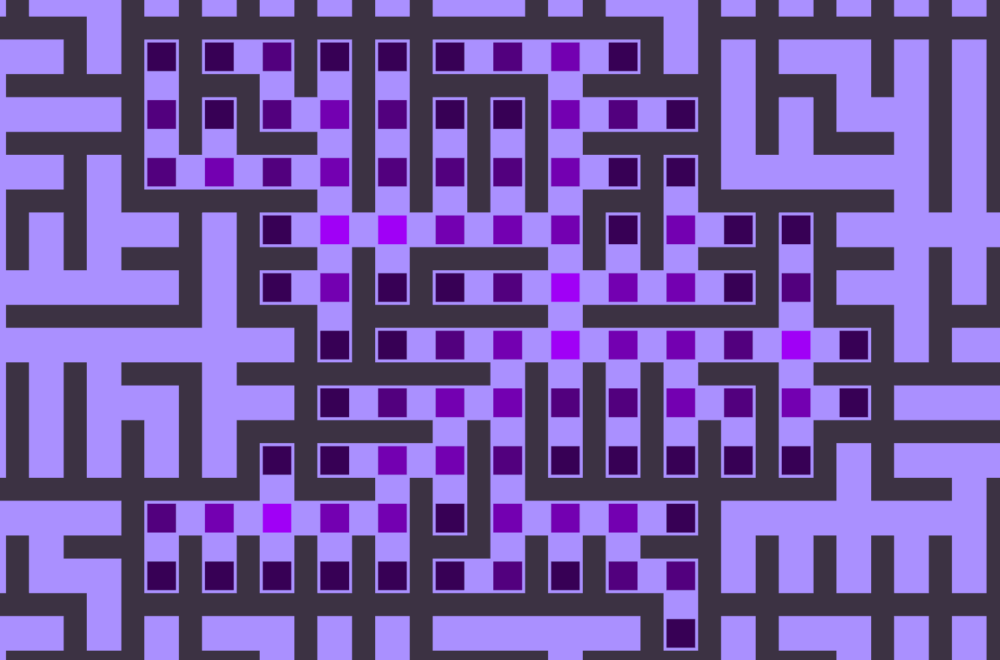
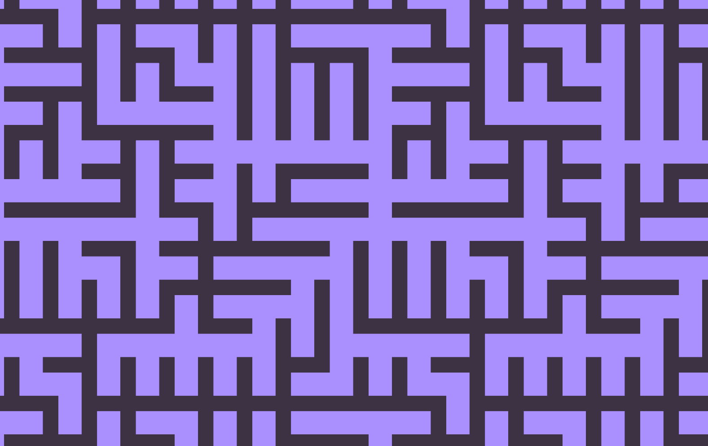

# Balyrinth

This project provides tools to generate labyrinths with several generation modes:
 
- Stack backtracking
- Queue backtracking
- Random backtracking
- Bloom

All genereations are reproductible from a seed.

Some rendered samples:

{height=100}
{height=100}
{height=100}
{height=100}
{height=100}

## Build 

### Prerequisites

You need to have these packages installed via vcpkg:
- For `LibLabyrinth`:
	- pcg:
		```
		vcpkg install pcg
		```

- For `BalyrinthGenerator`:
	- glew:
		```
		vcpkg install glew
		```
	- sdl3:
		```
		vcpkg install sdl3
		```
	- imgui[core,sdl3-binding,opengl3-binding]:
		```
		vcpkg.exe install imgui[core,sdl3-binding,opengl3-binding] --recurse
		```

### Build project

```
cmake -B build -S . -DCMAKE_TOOLCHAIN_FILE=YourVcpkgPath/scripts/buildsystems/vcpkg.cmake
```

You project will be buildable from `build` directory
