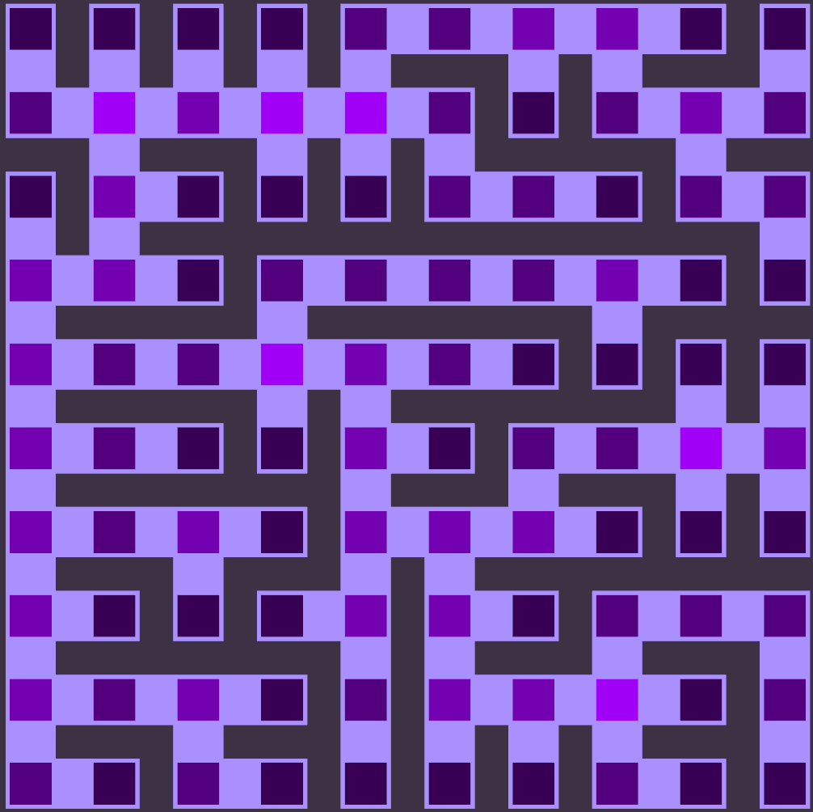
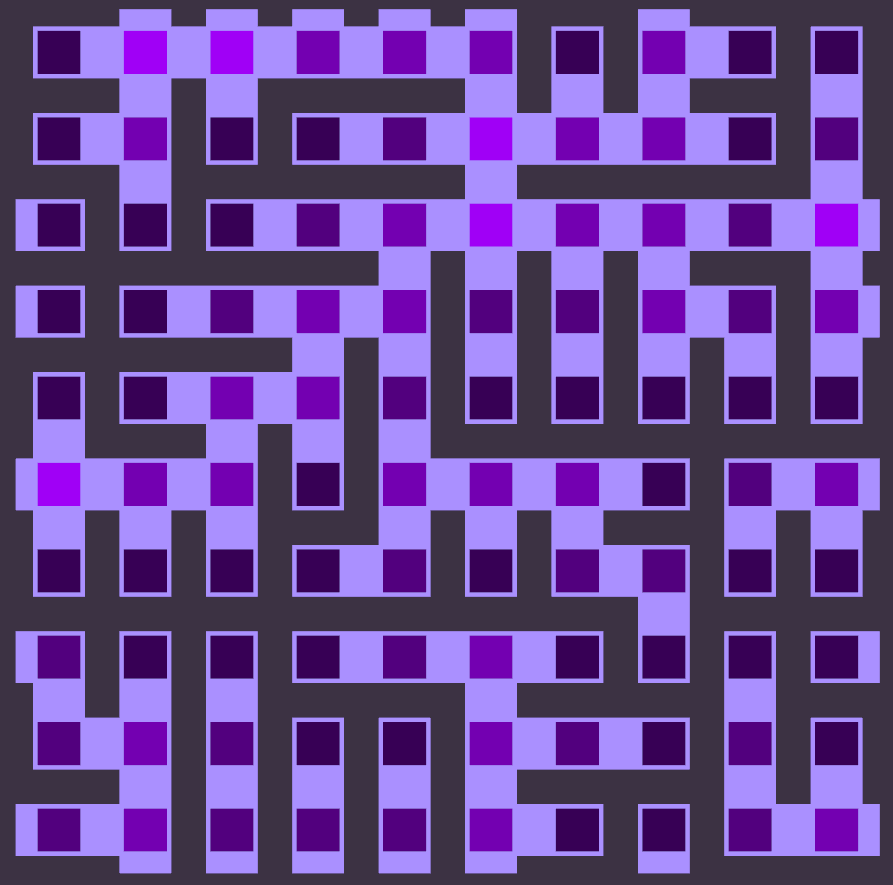
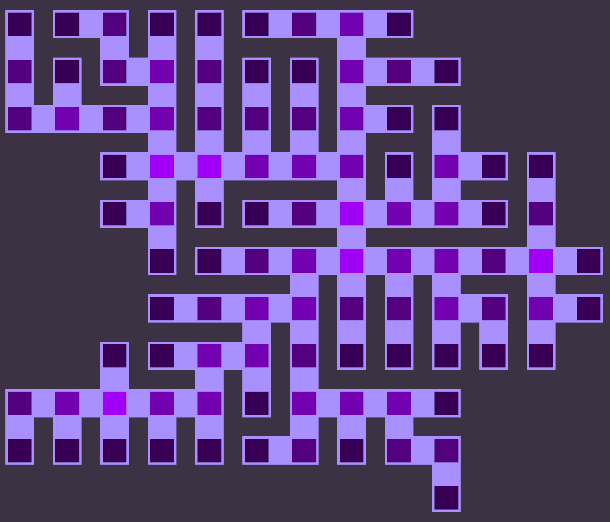
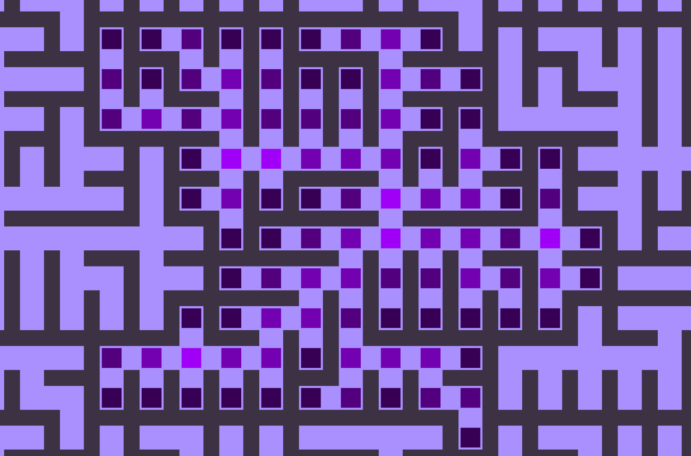
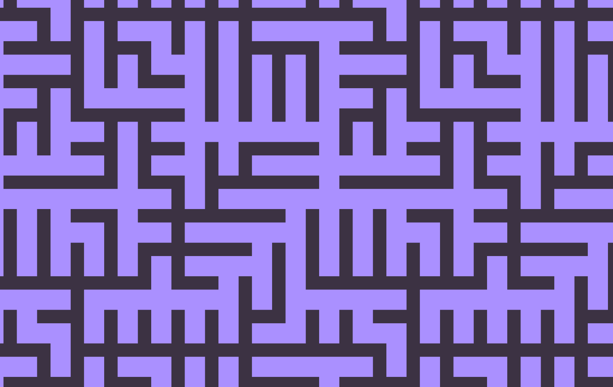

# Balyrinth

This project provides tools to generate labyrinths with several generation modes:
 
- Stack backtracking
- Queue backtracking
- Random backtracking
- Bloom

All genereations are reproductible from a seed.

Some rendered samples:

<div style="padding: 20px;">
	
	
	
	
	
</div>

## Build 

### Prerequisites

You need to have these packages installed via vcpkg (for Windows):
- For `LibLabyrinth`:
	- pcg:
		```
		vcpkg install pcg
		```

- For `BalyrinthGenerator`:
	- glew:
		```
		vcpkg install glew
		```
	- sdl3:
		```
		vcpkg install sdl3
		```

For Linux instal dev packages via apt or dnf because vcpkg for linux may miss some configurations for imgui an sdl3:

    - glew
	- sdl3
	- pcg

You need to use imgui as submodule (linux and windows), execute this commant in root dir of the project:

```
git submodule update --init --recursive
```

### Build project

```
cmake -B build -S . -DCMAKE_TOOLCHAIN_FILE=YourVcpkgPath/scripts/buildsystems/vcpkg.cmake
```

You project will be buildable from `build` directory
